# QuesMind AI 主动学习系统设计文档

## 1. 概述

### 1.1 项目定位
QuesMind 是一个基于 AI 的主动学习平台,通过"输入内容 → 生成问答 → 自我测试 → AI 评估 → 记忆巩固"的闭环流程,帮助用户高效掌握知识。

### 1.2 核心价值
- **自动化问答生成**:利用大语言模型自动从文章中提取关键知识点并生成问答对
- **主动学习机制**:通过问答形式促进主动回忆,提升记忆留存率
- **智能评估反馈**:AI 实时评分并提供个性化改进建议
- **进度可视化**:追踪学习轨迹,量化学习成果

### 1.3 目标用户
- 需要系统化学习知识的学生
- 准备考试或认证的职场人士
- 需要快速吸收大量文档的研究人员

### 1.4 技术栈概览

| 层级 | 技术选型 |
|------|---------|
| 前端框架 | Next.js 15 + React + TypeScript |
| UI 组件 | Tailwind CSS + shadcn/ui |
| 后端服务 | Next.js API Routes |
| 数据库 | PostgreSQL (Supabase) |
| AI 服务 | OpenAI API (GPT-4o-mini / GPT-4-turbo) |
| 认证系统 | Supabase Auth + JWT |
| 文件存储 | Supabase Storage |
| 部署平台 | Vercel |

## 2. 系统架构

### 2.1 整体架构

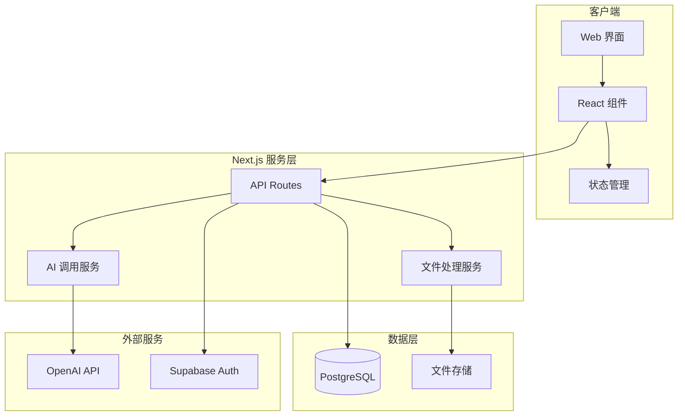

### 2.2 核心模块划分

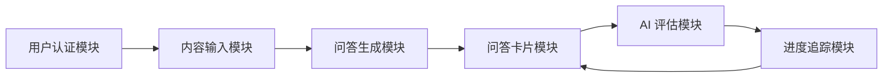

### 2.3 数据流架构

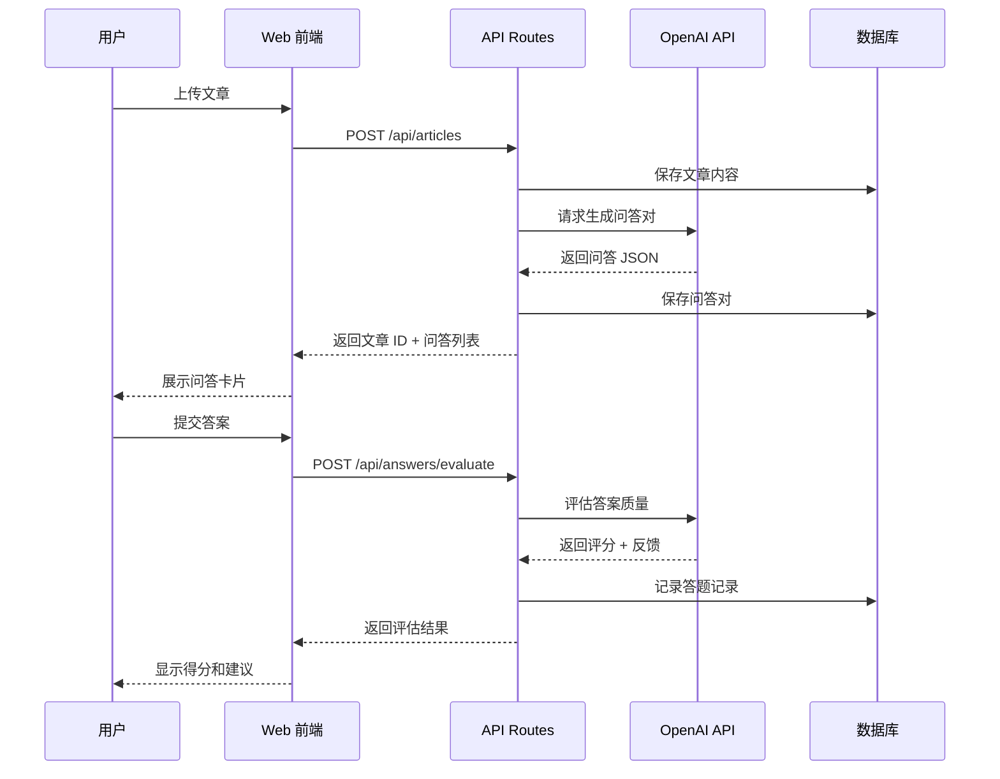

## 3. 前端架构

### 3.1 组件层级结构

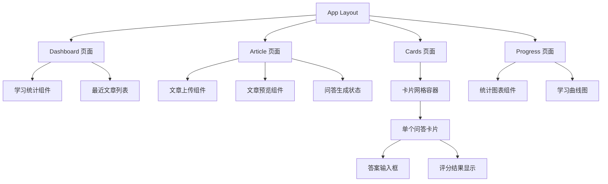

### 3.2 页面路由结构

| 路径 | 页面名称 | 功能描述 |
|------|---------|---------|
| `/` | Dashboard | 学习概览、进度统计、快捷入口 |
| `/articles/new` | 新建文章 | 上传/粘贴文章并生成问答 |
| `/articles/[id]` | 文章详情 | 查看文章原文及其问答列表 |
| `/cards` | 问答卡片库 | 所有问答卡片的浏览和筛选 |
| `/cards/review` | 复习模式 | 专注复习待掌握的卡片 |
| `/progress` | 学习统计 | 详细的学习数据分析 |
| `/auth/login` | 登录 | 用户认证入口 |

### 3.3 状态管理策略

采用 React Context + Hooks 方案:

| Context | 管理内容 | 核心状态 |
|---------|---------|---------|
| AuthContext | 用户认证状态 | user, session, isAuthenticated |
| ArticleContext | 文章数据 | articles, currentArticle, loading |
| CardContext | 问答卡片 | cards, filters, reviewQueue |
| ProgressContext | 学习进度 | stats, history, achievements |

### 3.4 核心组件设计

#### 文章上传组件 (ArticleUploader)

**功能职责**:
- 支持文本粘贴和文件拖拽上传
- 文件类型验证 (txt, pdf, docx)
- 上传进度显示
- 文章预览与编辑

**输入输出**:

| 类型 | 内容 |
|------|------|
| Props | onUploadSuccess, allowedTypes, maxSize |
| Emits | onFileSelected, onUploadComplete |
| State | fileContent, isUploading, uploadProgress |

#### 问答卡片组件 (QuestionCard)

**功能职责**:
- 展示问题内容
- 提供答案输入区域
- 切换显示标准答案
- 展示 AI 评分结果
- 标记掌握状态

**卡片状态机**:

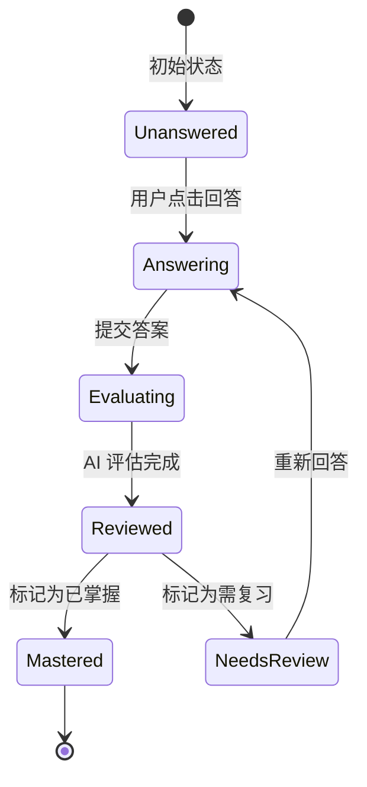

**数据结构**:

| 字段 | 类型 | 说明 |
|------|------|------|
| id | string | 卡片唯一标识 |
| questionText | string | 问题内容 |
| standardAnswer | string | 标准答案 |
| userAnswer | string | 用户答案 |
| aiScore | number | AI 评分 (0-100) |
| aiFeedback | string | AI 反馈建议 |
| status | enum | 卡片状态 |
| lastReviewedAt | timestamp | 最后复习时间 |

#### 学习统计图表组件 (ProgressChart)

**图表类型**:
- 折线图:每日答题数量趋势
- 柱状图:各主题掌握度分布
- 环形图:卡片状态占比
- 热力图:学习时间分布

## 4. 后端架构

### 4.1 API 端点设计

#### 文章管理 API

| 端点 | 方法 | 功能 | 请求参数 | 响应数据 |
|------|------|------|---------|---------|
| `/api/articles` | POST | 创建文章 | title, content, fileUrl | articleId, qaCount |
| `/api/articles` | GET | 获取文章列表 | page, limit, filter | articles[], total |
| `/api/articles/[id]` | GET | 获取文章详情 | - | article, qaPairs[] |
| `/api/articles/[id]` | DELETE | 删除文章 | - | success |

#### 问答生成 API

| 端点 | 方法 | 功能 | 请求参数 | 响应数据 |
|------|------|------|---------|---------|
| `/api/qa/generate` | POST | 生成问答对 | articleId, questionCount | qaPairs[], jobId |
| `/api/qa/status/[jobId]` | GET | 查询生成进度 | - | progress, status |

#### 答案评估 API

| 端点 | 方法 | 功能 | 请求参数 | 响应数据 |
|------|------|------|---------|---------|
| `/api/answers/evaluate` | POST | 评估答案 | cardId, userAnswer | score, feedback, suggestions |
| `/api/answers/history` | GET | 获取答题历史 | cardId, userId | attempts[], avgScore |

#### 进度统计 API

| 端点 | 方法 | 功能 | 请求参数 | 响应数据 |
|------|------|------|---------|---------|
| `/api/progress/stats` | GET | 获取整体统计 | userId, dateRange | totalCards, avgScore, reviewRate |
| `/api/progress/timeline` | GET | 获取时间线数据 | userId, period | dailyStats[] |

### 4.2 AI 服务集成层

#### 问答生成服务 (QAGenerationService)

**处理流程**:

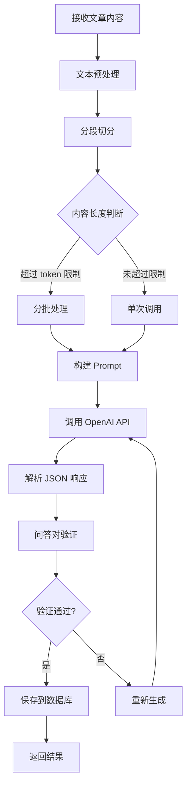

**Prompt 设计原则**:

| 要素 | 说明 |
|------|------|
| 角色定位 | 你是一位专业的教育内容设计师 |
| 任务描述 | 从给定文章中提取关键知识点并生成问答对 |
| 输出格式 | 严格 JSON 格式,包含 question 和 answer 字段 |
| 质量要求 | 问题要具体、答案要准确、难度适中 |
| 数量控制 | 根据文章长度生成 5-15 个问答对 |

#### 答案评估服务 (AnswerEvaluationService)

**评估维度**:

| 维度 | 权重 | 评估标准 |
|------|------|---------|
| 准确性 | 50% | 关键概念是否正确 |
| 完整性 | 30% | 是否覆盖主要要点 |
| 表达清晰度 | 20% | 逻辑是否连贯 |

**评分流程**:

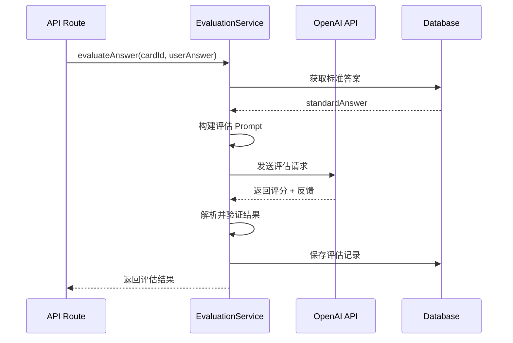

### 4.3 文件处理服务

#### 支持的文件类型及处理策略

| 文件类型 | 处理库 | 流程 |
|---------|--------|------|
| .txt | Node.js fs | 直接读取文本内容 |
| .pdf | pdf-parse | 提取文本 → 清理格式 → 返回纯文本 |
| .docx | mammoth | 转换为 HTML → 清理标签 → 提取文本 |

#### 文件处理流程

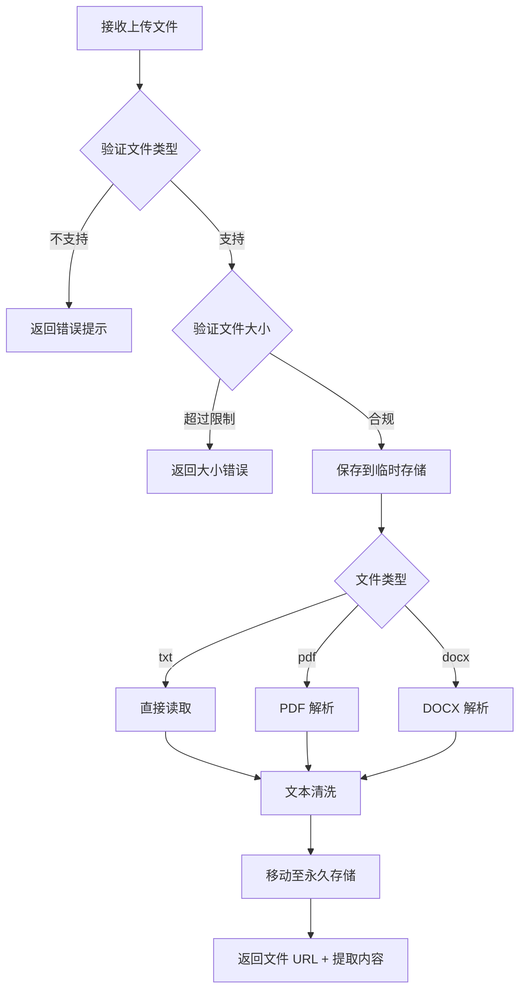

## 5. 数据模型设计

### 5.1 核心数据表结构

#### users 用户表

| 字段名 | 数据类型 | 约束 | 说明 |
|--------|---------|------|------|
| id | UUID | PRIMARY KEY | 用户唯一标识 |
| email | VARCHAR(255) | UNIQUE, NOT NULL | 邮箱 |
| username | VARCHAR(100) | - | 用户名 |
| created_at | TIMESTAMP | DEFAULT NOW() | 创建时间 |
| updated_at | TIMESTAMP | - | 更新时间 |

#### articles 文章表

| 字段名 | 数据类型 | 约束 | 说明 |
|--------|---------|------|------|
| id | UUID | PRIMARY KEY | 文章唯一标识 |
| user_id | UUID | FOREIGN KEY | 所属用户 |
| title | VARCHAR(500) | NOT NULL | 文章标题 |
| content | TEXT | NOT NULL | 文章内容 |
| file_url | VARCHAR(1000) | - | 原始文件 URL |
| word_count | INTEGER | - | 字数统计 |
| qa_count | INTEGER | DEFAULT 0 | 问答对数量 |
| created_at | TIMESTAMP | DEFAULT NOW() | 创建时间 |

#### qa_pairs 问答对表

| 字段名 | 数据类型 | 约束 | 说明 |
|--------|---------|------|------|
| id | UUID | PRIMARY KEY | 问答对唯一标识 |
| article_id | UUID | FOREIGN KEY | 所属文章 |
| question_text | TEXT | NOT NULL | 问题内容 |
| standard_answer | TEXT | NOT NULL | 标准答案 |
| difficulty_level | INTEGER | 1-5 | 难度等级 |
| created_at | TIMESTAMP | DEFAULT NOW() | 创建时间 |

#### answer_attempts 答题记录表

| 字段名 | 数据类型 | 约束 | 说明 |
|--------|---------|------|------|
| id | UUID | PRIMARY KEY | 记录唯一标识 |
| qa_pair_id | UUID | FOREIGN KEY | 问答对 ID |
| user_id | UUID | FOREIGN KEY | 答题用户 ID |
| user_answer | TEXT | NOT NULL | 用户答案 |
| ai_score | DECIMAL(5,2) | 0-100 | AI 评分 |
| ai_feedback | TEXT | - | AI 反馈 |
| time_spent | INTEGER | - | 答题用时(秒) |
| is_mastered | BOOLEAN | DEFAULT FALSE | 是否已掌握 |
| created_at | TIMESTAMP | DEFAULT NOW() | 答题时间 |

#### card_status 卡片状态表

| 字段名 | 数据类型 | 约束 | 说明 |
|--------|---------|------|------|
| id | UUID | PRIMARY KEY | 记录唯一标识 |
| qa_pair_id | UUID | FOREIGN KEY | 问答对 ID |
| user_id | UUID | FOREIGN KEY | 用户 ID |
| status | ENUM | - | unanswered/reviewing/mastered |
| review_count | INTEGER | DEFAULT 0 | 复习次数 |
| last_reviewed_at | TIMESTAMP | - | 最后复习时间 |
| next_review_at | TIMESTAMP | - | 下次复习时间 |

### 5.2 数据关系图

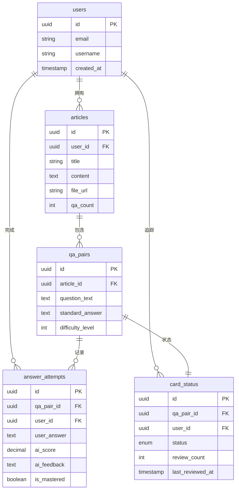

## 6. 业务逻辑层架构

### 6.1 文章处理业务流程

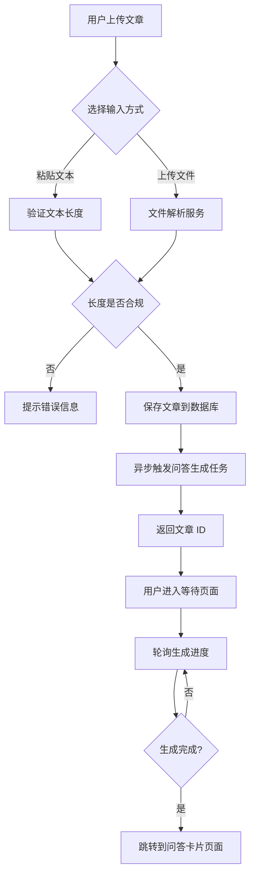

### 6.2 问答生成业务逻辑

**生成策略**:

| 文章字数 | 问答对数量 | 处理方式 |
|---------|----------|---------|
| < 500 字 | 3-5 个 | 单次生成 |
| 500-2000 字 | 5-10 个 | 单次生成 |
| 2000-5000 字 | 10-15 个 | 分段生成 |
| > 5000 字 | 15-20 个 | 分段生成 + 合并去重 |

**质量控制机制**:

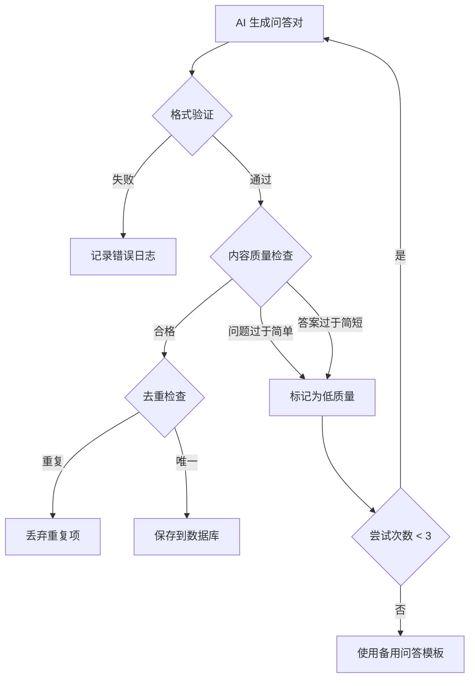

### 6.3 答案评估业务逻辑

**评估流程**:

```mermaid
stateDiagram-v2
    [*] --> 接收答案
    接收答案 --> 预处理答案文本
    预处理答案文本 --> 调用AI评估
    调用AI评估 --> 解析评估结果
    
    解析评估结果 --> 判断得分
    判断得分 --> 高分(>=80): 得分>=80
    判断得分 --> 中等(60-79): 60<=得分<80
    判断得分 --> 低分(<60): 得分<60
    
    高分(>=80) --> 建议标记为已掌握
    中等(60-79) --> 建议继续复习
    低分(<60) --> 建议重新学习
    
    建议标记为已掌握 --> 更新卡片状态
    建议继续复习 --> 更新卡片状态
    建议重新学习 --> 更新卡片状态
    
    更新卡片状态 --> 记录到答题历史
    记录到答题历史 --> [*]
```

**反馈生成策略**:

| 得分区间 | 反馈类型 | 反馈内容示例 |
|---------|---------|------------|
| 90-100 | 优秀 | "回答非常准确完整,已充分掌握该知识点" |
| 80-89 | 良好 | "核心内容正确,建议补充以下细节..." |
| 60-79 | 中等 | "理解基本正确,但遗漏了关键点..." |
| 40-59 | 需改进 | "部分理解有偏差,建议重点复习..." |
| 0-39 | 未掌握 | "理解存在较大偏差,建议重新学习原文" |

### 6.4 学习进度计算逻辑

**核心指标定义**:

| 指标名称 | 计算公式 | 说明 |
|---------|---------|------|
| 掌握率 | 已掌握卡片数 / 总卡片数 × 100% | 整体学习完成度 |
| 平均得分 | 所有答题记录的平均分 | 学习质量评估 |
| 复习频率 | 最近7天答题次数 / 7 | 学习活跃度 |
| 知识留存率 | 第二次答题得分 / 第一次答题得分 | 记忆巩固效果 |

**复习提醒算法** (简化版 Spaced Repetition):

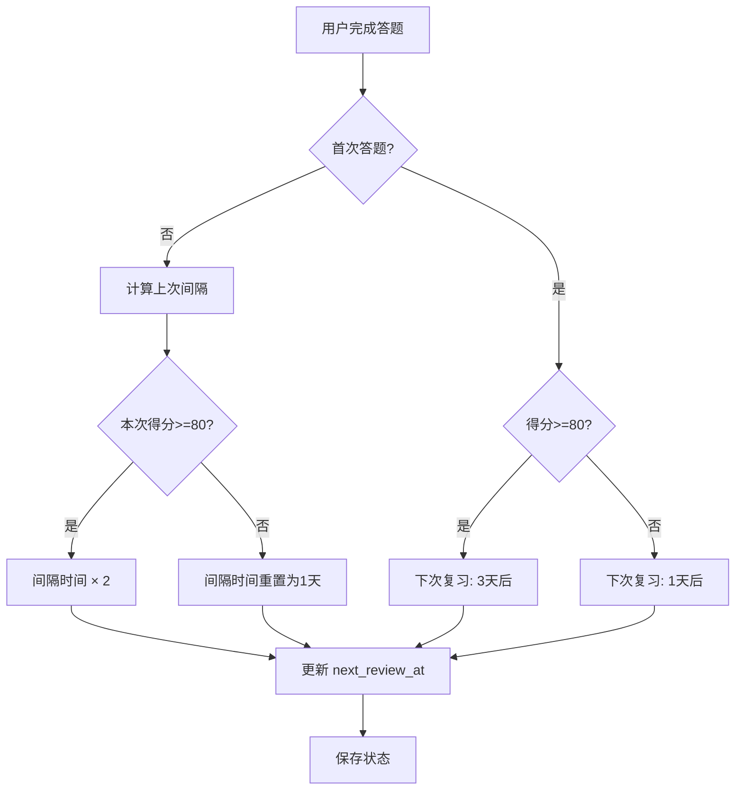

## 7. 认证与授权

### 7.1 认证流程

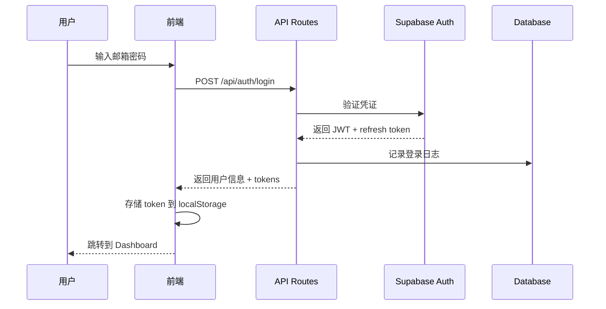

### 7.2 权限控制策略

**行级安全策略 (Row Level Security)**:

| 表名 | 策略 | 规则 |
|------|------|------|
| articles | 读权限 | user_id = auth.uid() |
| articles | 写权限 | user_id = auth.uid() |
| qa_pairs | 读权限 | article.user_id = auth.uid() |
| answer_attempts | 读权限 | user_id = auth.uid() |
| answer_attempts | 写权限 | user_id = auth.uid() |

### 7.3 API 路由保护

**中间件验证流程**:

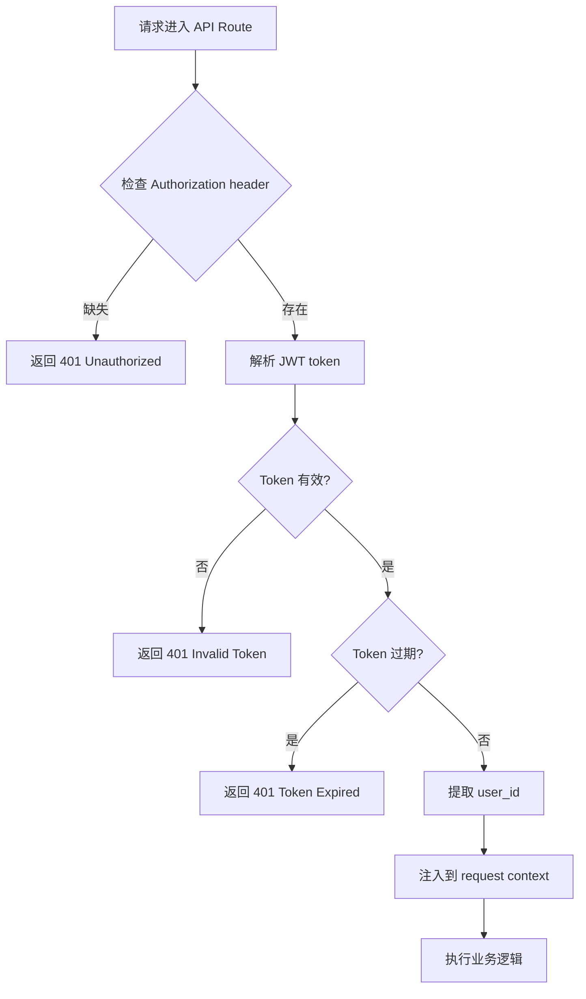

## 8. 测试策略

### 8.1 前端测试

#### 单元测试范围

| 组件/函数 | 测试重点 | 工具 |
|----------|---------|------|
| QuestionCard | 状态切换、事件触发 | Jest + React Testing Library |
| ArticleUploader | 文件验证、上传进度 | Jest |
| ProgressChart | 数据计算、图表渲染 | Jest + Recharts |
| 工具函数 | 文本处理、时间格式化 | Jest |

#### 集成测试场景

- 完整答题流程:选择卡片 → 输入答案 → 提交 → 查看评分
- 文章上传流程:上传文件 → 解析 → 生成问答 → 展示卡片
- 进度统计流程:答题 → 数据更新 → 图表刷新

### 8.2 后端测试

#### API 端点测试

| 端点 | 测试场景 | 预期结果 |
|------|---------|---------|
| POST /api/articles | 有效文章内容 | 返回 201 + articleId |
| POST /api/articles | 空内容 | 返回 400 错误 |
| POST /api/qa/generate | 正常文章 | 异步生成成功 |
| POST /api/qa/generate | 超长文章 | 分批处理成功 |
| POST /api/answers/evaluate | 正确答案 | 高分 + 正面反馈 |
| POST /api/answers/evaluate | 错误答案 | 低分 + 改进建议 |

#### AI 服务测试策略

**Mock 策略**:
- 单元测试:Mock OpenAI API 响应,测试数据解析逻辑
- 集成测试:使用真实 API(消耗少量 token),验证端到端流程
- 异常测试:模拟 API 超时、限流、错误响应

### 8.3 测试数据管理

**测试用例覆盖**:

| 数据类型 | 测试样本 |
|---------|---------|
| 短文章 | 200字科普文章 |
| 中等文章 | 1000字技术博客 |
| 长文章 | 5000字学术论文摘要 |
| 特殊字符 | 包含代码块、公式的文章 |
| 边界情况 | 空文章、超长文章、纯符号 |

## 9. 性能优化策略

### 9.1 前端优化

| 优化项 | 具体措施 | 预期效果 |
|--------|---------|---------|
| 首屏加载 | Next.js SSR + 路由预加载 | FCP < 1.5s |
| 图片资源 | WebP 格式 + 懒加载 | 减少 60% 带宽 |
| 组件渲染 | React.memo + useMemo | 减少无效渲染 |
| 状态管理 | 精细化 Context 拆分 | 避免全局重渲染 |
| 打包优化 | Tree-shaking + 代码分割 | Bundle 体积 < 200KB |

### 9.2 后端优化

**数据库查询优化**:

| 场景 | 优化措施 |
|------|---------|
| 文章列表查询 | 添加索引 (user_id, created_at) |
| 问答对查询 | 联表查询改为分步查询 + 缓存 |
| 统计数据 | 使用物化视图预计算 |
| 频繁访问数据 | Redis 缓存热点数据 |

**API 响应优化**:

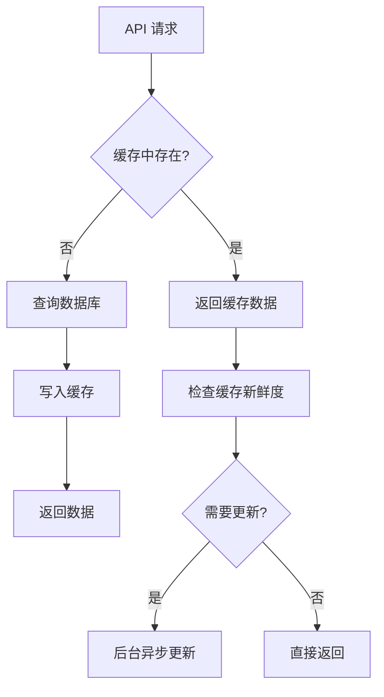

### 9.3 AI 调用优化

| 优化项 | 措施 | 收益 |
|--------|------|------|
| Token 消耗 | 使用 GPT-4o-mini 替代 GPT-4 | 成本降低 90% |
| 响应速度 | 流式输出 (Stream) | 用户感知延迟减少 |
| 并发控制 | 限制同时调用数为 5 | 避免限流 |
| 结果缓存 | 相同问题24小时内复用 | 减少重复调用 |

## 10. 安全设计

### 10.1 数据安全

| 威胁 | 防护措施 |
|------|---------|
| SQL 注入 | 使用参数化查询,ORM 框架 |
| XSS 攻击 | React 自动转义 + CSP 策略 |
| CSRF 攻击 | SameSite Cookie + CSRF Token |
| 敏感数据泄露 | 数据库字段加密,HTTPS 传输 |

### 10.2 API 安全

**速率限制策略**:

| 端点类型 | 限制规则 | 超限响应 |
|---------|---------|---------|
| 登录接口 | 5次/分钟/IP | 429 + 冷却时间 |
| 问答生成 | 10次/小时/用户 | 429 + 错误提示 |
| 答案评估 | 60次/小时/用户 | 429 + 错误提示 |
| 查询接口 | 100次/分钟/用户 | 429 + 错误提示 |

### 10.3 用户隐私保护

**数据处理原则**:
- 文章内容仅用于问答生成,不用于其他用途
- 用户答案数据不与第三方共享
- AI 调用时去除用户标识信息
- 用户可随时删除个人数据

## 11. 部署架构

### 11.1 部署流程

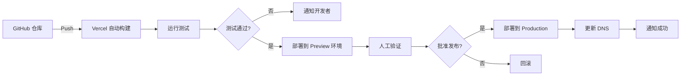

### 11.2 环境配置

| 环境 | 用途 | 数据库 | AI 配额 |
|------|------|--------|--------|
| Development | 本地开发 | 本地 PostgreSQL | 测试 Key |
| Preview | 功能预览 | Supabase 测试库 | 限量 Key |
| Production | 正式环境 | Supabase 生产库 | 正式 Key |

### 11.3 监控与日志

**关键指标监控**:

| 指标类型 | 监控项 | 告警阈值 |
|---------|-------|---------|
| 性能指标 | API 响应时间 | > 2s |
| 性能指标 | 页面加载时间 | > 3s |
| 错误指标 | 5xx 错误率 | > 1% |
| 错误指标 | AI 调用失败率 | > 5% |
| 业务指标 | 问答生成成功率 | < 95% |
| 业务指标 | 用户答题完成率 | < 60% |

**日志记录策略**:

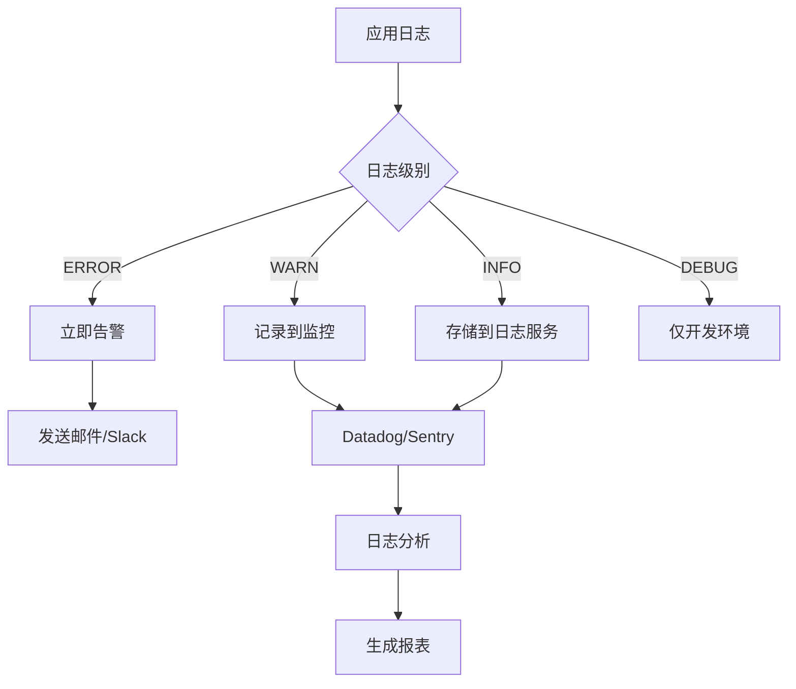

## 12. MVP 开发路线图

### 12.1 阶段划分

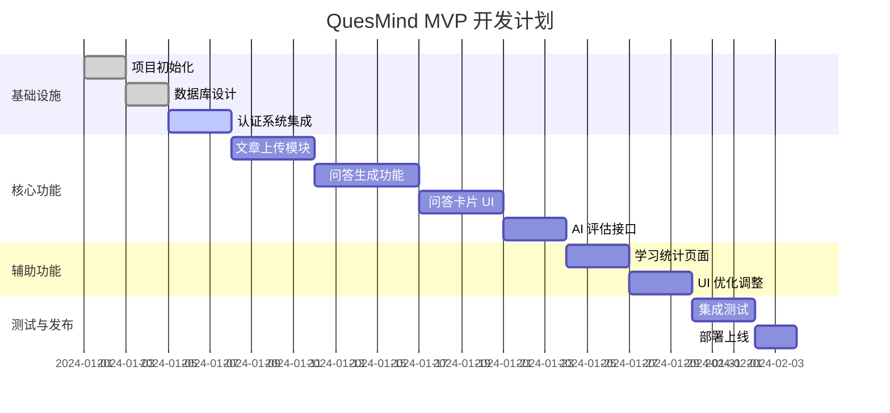

### 12.2 各阶段交付物

#### Week 1: 基础设施搭建
- Next.js 项目脚手架
- Supabase 数据库表结构
- Supabase Auth 集成
- 基础 Layout 和路由

#### Week 2: 内容输入与生成
- 文章上传组件 (文本 + 文件)
- 文件解析服务 (txt, pdf, docx)
- OpenAI API 集成
- 问答生成功能
- 异步任务进度展示

#### Week 3: 问答交互核心
- 问答卡片组件
- 答案输入与提交
- AI 评估接口
- 评分结果展示
- 卡片状态管理

#### Week 4: 数据统计与优化
- Dashboard 统计页面
- 学习曲线图表
- UI/UX 细节优化
- 响应式适配
- 错误处理完善

### 12.3 技术风险与应对

| 风险项 | 影响 | 应对措施 |
|--------|------|---------|
| OpenAI API 不稳定 | 问答生成失败 | 实现重试机制 + 备用方案 |
| PDF 解析错误 | 内容提取不完整 | 多种解析库互补 + 人工校验 |
| Token 消耗超预算 | 成本过高 | 使用 mini 模型 + 结果缓存 |
| 数据库查询慢 | 用户体验差 | 索引优化 + 分页加载 |

## 13. 未来扩展方向

### 13.1 功能扩展

| 功能模块 | 说明 | 优先级 |
|---------|------|-------|
| 多人协作 | 支持分享文章和问答集 | 中 |
| 知识图谱 | 关联相关知识点,构建知识网络 | 中 |
| 语音答题 | 支持语音输入答案 | 低 |
| 移动端 App | iOS/Android 原生应用 | 高 |
| 智能推荐 | 基于学习情况推荐复习内容 | 中 |
| 导出功能 | 导出问答集为 PDF/Anki 格式 | 中 |

### 13.2 技术演进

**短期 (3-6个月)**:
- 引入 Redis 缓存层
- 实现全文搜索功能 (Elasticsearch)
- 优化移动端体验

**中期 (6-12个月)**:
- 微服务架构拆分 (AI 服务独立)
- 支持私有化部署
- 多语言国际化

**长期 (1年以上)**:
- 自研轻量级评估模型
- 实时协作编辑
- 跨平台数据同步
